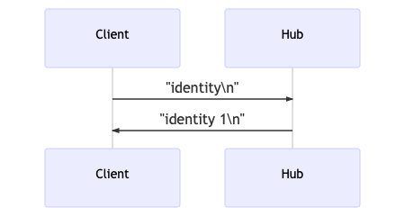
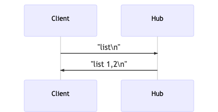
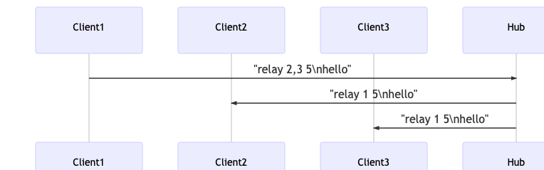

# Golang backend assignment

## Table of contents

* [Running and building](#running-and-building)
* [Testing](#testing)

In this simplified scenario the message delivery system includes the following parts:

### Hub

Hub relays incoming message bodies to receivers based on user ID(s) defined in the message.
You don't need to implement authentication, hub can for example assign arbitrary (unique) user id to the client once its connected.

- user_id - unsigned 64 bit integer
- Connection to hub must be done using pure TCP. Protocol doesnt require multiplexing.

### Clients

Clients are users who are connected to the hub. Client may send three types of messages which are described below.

### Identity message
Client can send a identity message which the hub will answer with the user_id of the connected user.

#### Identity message protocol

### List message
Client can send a list message which the hub will answer with the list of all connected client user_id:s (excluding the requesting client).

#### List message protocol
Response will have list of client ids as a string separated by comma

### Relay message
Client can send a relay messages which body is relayed to receivers marked in the message.
Design the optimal data format for the message delivery system, so that it consumes minimal amount of resources (memory, cpu, etc.).
Message body can be relayed to one or multiple receivers.

- max 255 receivers (user_id:s) per message
- message body - byte array (text, JSON, binary, or anything), max length 1024 kilobytes

*Relay example: receivers: 2 and 3, body: foobar*

#### Relay message protocol
Message send to server looks like this "relay 2,3 5\nhello", "2,3" is recipients, "5" is number bytes of data, the data is "hello"

Message send to client looks like this "relay 1 5\nhello", "1" is sender ID, "5" is number bytes of data, the data is "hello" 

## Running and building

The project already includes necessary infrastructure for building and running the hub.
It has Makefile with targets for building and testing both client and server.

## Testing

The project contains integration and benchmark tests for the hub (including both client and server), 
so make sure your implementation is compatible and the tests pass without making major changes to them.
Please add unit tests for you implementation, without them the assignment will be rejected.
